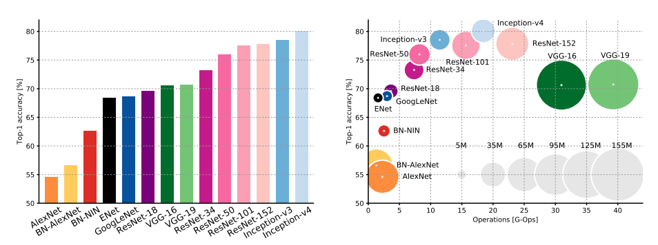
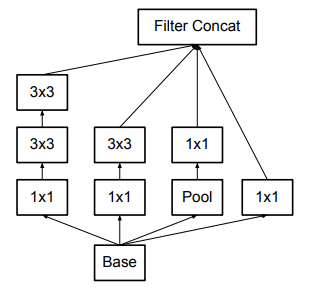
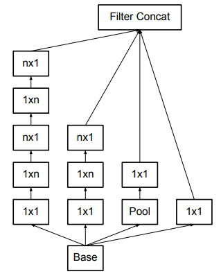
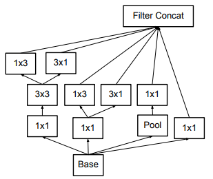

# Network of each paper

## Backbone

image from [https://arxiv.org/pdf/1605.07678.pdf](https://arxiv.org/pdf/1605.07678.pdf)

1.   **LeNet:** Gradient-Based Learning Applied to Document Recognition | [paper](http://yann.lecun.com/exdb/publis/pdf/lecun-01a.pdf) | [net](http://ethereon.github.io/netscope/#/gist/5137a29b2c32b3785817928f71711d6a) |

    <table>
        <tr>
            <td align="center"></td>
        </tr>
    </table>

2.  **AlexNet:**  ImageNet Classification with Deep Convolutional Neural Networks | [paper](https://papers.nips.cc/paper/4824-imagenet-classification-with-deep-convolutional-neural-networks.pdf) | [slides](http://image-net.org/challenges/LSVRC/2012/supervision.pdf) |

    <table>
        <tr>
            <td align="center"></td>   
        </tr>
    </table>

3.  **VGGNet:** Very Deep Convolutional Networks for Large-Scale Image Recognition | [paper](https://arxiv.org/abs/1409.1556) | [slides](http://www.image-net.org/challenges/LSVRC/2014/slides/VGG_ILSVRC_2014.pdf) |

    <table align="center">
        <tr>
            <td align="center"></td>   
        </tr>
        <tr>
            <td align="center"><b>VGG16</b> </td>   
        </tr>
    </table>

4.  **GoogLeNet:**  Going Deeper With Convolutions | [paper](http://arxiv.org/abs/1409.4842) | [slides](http://www.image-net.org/challenges/LSVRC/2014/slides/GoogLeNet.pptx) |

    <table>
        <tr>
            <td align="center"></td>   
        </tr>
        <tr>
            <td align="center"></td>   
        </tr>
    </table>

5.  **ResNet:**  Deep Residual Learning for Image Recognition | [paper](https://arxiv.org/abs/1512.03385) | [slides](http://image-net.org/challenges/talks/ilsvrc2015_deep_residual_learning_kaiminghe.pdf) |

    <table>
        <tr>
            <td align="center"></td>
            <td align="center"></td>   
        </tr>
    </table>

6.  **InceptionV3:**  Rethinking the Inception Architecture for Computer Vision | [paper](https://arxiv.org/abs/1512.00567) |

    <table>
        <tr>
            <td align="center"></td>   
        </tr>
    </table>

    |Inception Module A|Inception Module B|Inception Module C|
    |:----:|:----:|:----:|
    ||||

7.  **Xception:** Xception: Deep Learning with Depthwise Separable Convolutions | [paper](https://arxiv.org/abs/1610.02357) |

    <table>
        <tr>
            <td align="center"></td>   
        </tr>
    </table>

8.  **Inception-v4, Inception-ResNet-v1, Inception-ResNet-V2:**  Inception-v4, Inception-ResNet and the Impact of Residual Connections on Learning | [paper](https://arxiv.org/pdf/1602.07261.pdf) |

    <table>
        <tr>
            <td align="center"><b>Inception-v4</b></td> 
            <td align="center"><b>Stem</b></td>
            <td align="center"><b>Inception Block</b></td>
            <td align="center"><b> Schema</b></td>  
        </tr>
        <tr>
            <td rowspan="3"></td> 
            <td rowspan="3"></td>   
            <td align="center"><b>Inception-A</b>   </td>
            <td align="center"><b>35×35 to 17×17</b> </td>
        </tr>
        <tr>
            <td align="center"><b>Inception-B</b>   </td> 
            <td align="center"><b>17×17 to 8×8</b> </td> 
        </tr>
        <tr>
            <td align="center"><b>Inception-C</b>   </td>  
        </tr>
    </table>

    <table>
        <tr>
            <td align="center"><b>Inception-ResNet-v1</b></td> 
            <td align="center"><b>Stem</b></td>
            <td align="center"><b>Inception-ResNet Block</b></td>
            <td align="center"><b> Schema</b></td>  
        </tr>
        <tr>
            <td rowspan="3"></td> 
            <td rowspan="3"></td>   
            <td align="center"><b>Inception-ResNet-A</b>   </td>
            <td align="center"><b>35×35 to 17×17</b> </td>
        </tr>
        <tr>
            <td align="center"><b>Inception-ResNet-B</b>   </td> 
            <td align="center"><b>17×17 to 8×8</b> </td> 
        </tr>
        <tr>
            <td align="center"><b>Inception-ResNet-C</b>   </td>  
        </tr>
    </table>

    <table>
        <tr>
            <td align="center"><b>Inception-ResNet-v2</b></td> 
            <td align="center"><b>Stem</b></td>
            <td align="center"><b>Inception-ResNet Block</b></td>
            <td align="center"><b> Schema</b></td>  
        </tr>
        <tr>
            <td rowspan="3"></td> 
            <td rowspan="3"></td>   
            <td align="center"><b>Inception-ResNet-A</b>   </td>
            <td align="center"><b>35×35 to 17×17</b> </td>
        </tr>
        <tr>
            <td align="center"><b>Inception-ResNet-B</b>   </td> 
            <td align="center"><b>17×17 to 8×8</b> </td> 
        </tr>
        <tr>
            <td align="center"><b>Inception-ResNet-C</b>   </td>  
        </tr>
    </table>

9.  **DenseNet:** Densely Connected Convolutional | [paper](https://arxiv.org/abs/1608.06993) | [slides](http://www.gaohuang.net/papers/DenseNet-CVPR-Slides.pdf) |

    <table>
        <tr>
            <td align="center"></td>
        </tr>
        <tr>
            <td align="center"></td>
        </tr>
        <tr>
            <td align="center"></td>   
        </tr>
    </table>

10.  **NASNet:** Learning Transferable Architectures for Scalable Image Recognition |[paper](https://arxiv.org/abs/1707.07012) | 

    <table>
        <tr>
            <td align="center"></td>   
        </tr>
    </table>

11.  **MobileNet:** MobileNets: Efficient Convolutional Neural Networks for Mobile Vision Applications | [paper](https://arxiv.org/abs/1704.04861) | 

    <table>
        <tr>
            <td align="center"></td>  
            <td align="center"></td>  
        </tr>
    </table>

12.  **MobileNetV2** MobileNetV2: Inverted Residuals and Linear Bottlenecks | [paper](https://arxiv.org/abs/1801.04381) | 

    <table>
        <tr>
            <td align="center"></td>
            <td align="center"></td>  
        </tr>
        <tr>
            <td align="center"></td> 
            <td align="center"></td> 
        </tr>
    </table>

13.  **ShuffleNet:** ShuffleNet: An Extremely Efficient Convolutional Neural Network for Mobile Devices | [paper](https://arxiv.org/abs/1707.01083) | 

    <table>
        <tr>
            <td align="center"></td>  
        </tr>
        <tr>
            <td align="center"></td>  
        </tr>
    </table>

14.  **ShuffleNetV2** ShuffleNet V2: Practical Guidelines for Efficient CNN Architecture Design | [paper](https://arxiv.org/abs/1807.11164) | 

    <table>
        <tr>
            <td align="center"></td>  
        </tr>
        <tr>
            <td align="center"></td>  
        </tr>
    </table>

----

## Two stage Object Detection

1. **RCNN:** Rich feature hierarchies for accurate object detection and semantic segmentation

    <table>
        <tr>
            <td align="center"></td>
        </tr>
    </table>

2. **Fast R-CNN:** Fast R-CNN

    <table>
        <tr>
            <td align="center"></td>
        </tr>
    </table>

3. **Faster R-CNN:** Faster R-CNN: Towards Real-Time Object Detection with Region Proposal Networks

    <table>
        <tr>
            <td align="center"></td>
            <td align="center"></td>
        </tr>
    </table>

4. **R-FCN:** R-FCN: Object Detection via Region-based Fully Convolutional Networks

    <table>
        <tr>
            <td align="center"></td>
        </tr>
        <tr>
            <td align="center"></td>
        </tr>
    </table>

5. R-FCN-3000 at 30fps: Decoupling Detection and Classification

    <table>
        <tr>
            <td align="center"></td>
        </tr>
    </table>

6. **CoupleNet：** CoupleNet:Coupling Global Structure with Local Parts for Object Detection

    <table>
        <tr>
            <td align="center"></td>  
        </tr>
    </table>

7. **FPN:** Feature Pyramid Networks for Object Detection

    <table>
        <tr>
            <td align="center"></td>
            <td align="center"></td> 
        </tr>
        <tr>
            <td align="center"></td>
            <td align="center"></td>
        </tr>
    </table>

8. **Mask R-CNN:** Mask R-CNN

    <table>
        <tr>
            <td align="center"></td> 
            <td align="center"></td> 
        </tr>
    </table>

9. **Light-Head R-CNN:** Light-Head R-CNN: In Defense of Two-Stage Object Detector

    <table>
        <tr>
            <td align="center"></td> 
        </tr>
    </table>

10. **OHEM:** Training Region-based Object Detectors with Online Hard Example Mining

    <table>
        <tr>
            <td align="center"></td>
        </tr>
    </table>

11. **S-OHEM:** S-OHEM: Stratified Online Hard Example Mining for Object Detection

    <table>
        <tr>
            <td align="center"></td>
        </tr>
    </table>

12. **PVANet:** PVANet: Lightweight Deep Neural Networks for Real-time Object Detection

    <table>
        <tr>
            <td align="center"></td>
        </tr>
        <tr>
            <td align="center"></td>
        </tr>
    </table>

13. Interpretable R-CNN

    <table>
        <tr>
            <td align="center"></td> 
        </tr>
    </table>

14. Feature Selective Networks for Object Detection

    <table>
        <tr>
            <td colspan="2" align="center"></td> 
        </tr>
        <tr>
            <td align="center"></td>
            <td align="center"></td>
        </tr>
    </table>

15. **Cascade R-CNN:** Cascade R-CNN: Delving into High Quality Object Detection 

    <table>
        <tr>
            <td align="center"></td>  
        </tr>
    </table>

16. CRAFT Objects from Images

    <table>
        <tr>
            <td align="center"></td>  
        </tr>
        <tr>
            <td align="center"></td>  
        </tr>
        <tr>
            <td align="center"></td>  
        </tr>
    </table>

----

## One stage Object Detection

1. **YOLO:** You Only Look Once: Unified, Real-Time Object Detection

    <table>
        <tr>
            <td align="center"></td>
        </tr>
    </table>

2. **SSD:** SSD: Single Shot MultiBox Detector

    <table>
        <tr>
            <td align="center"></td>
        </tr>
    </table>

3. **DSSD:** DSSD : Deconvolutional Single Shot Detector

    <table>
        <tr>
            <td align="center"></td>
        </tr>
        <tr>
            <td align="center"></td>
        </tr>
        <tr>
            <td align="center"></td>
        </tr>
    </table>

4. **RefineDet:** Single-Shot Refinement Neural Network for Object Detection

    <table>
        <tr>
            <td align="center"></td>
        </tr>
    </table>

5. **RRC:** Accurate Single Stage Detector Using Recurrent Rolling Convolution

    <table>
        <tr>
            <td align="center"></td>  
        </tr>
        <tr>
            <td align="center"></td>  
        </tr>
    </table>

6. **CFENet:** CFENet: An Accurate and Efficient Single-Shot Object Detector for Autonomous Driving

    <table>
        <tr>
            <td align="center"></td>  
        </tr>
    </table>

7. **RBFNET:** Receptive Field Block Net for Accurate and Fast Object Detection

    <table>
        <tr>
            <td colspan="2" align="center"></td>
        </tr>
        <tr>
            <td colspan="2" align="center"></td>
        </tr>
        <tr>
            <td colspan="2" align="center"></td>
        </tr>
        <tr>
            <td align="center"></td>
            <td align="center"></td>
        </tr>
    </table>

8. **RetinaNet:** Focal Loss for Dense Object Detection

    <table>
        <tr>
            <td align="center"></td>
            <td align="center"></td>
        </tr>
        <tr>
            <td colspan="2" align="center"></td>
        </tr>
    </table>

9. Single-Shot Object Detection with Enriched Semantics

    <table>
        <tr>
            <td align="center"></td>
        </tr>
        <tr>
            <td align="center"></td>
        </tr>
    </table>

10. **$S^3FD$:**  S3FD: Single Shot Scale-invariant Face Detector

    <table>
        <tr>
            <td align="center"></td>
        </tr>
    </table>

11. **FSSD:** FSSD: Feature Fusion Single Shot Multibox Detector

    <table>
        <tr>
            <td colspan="2" align="center"></td> 
        </tr>
        <tr>
            <td align="center"></td>
            <td align="center"></td> 
        </tr>
    </table>

12. **Feature-Fused SSD:** Feature-Fused SSD: Fast Detection for Small Objects

    <table>
        <tr>
            <td colspan="2" align="center"></td> 
        </tr>
        <tr>
            <td align="center"></td>
            <td align="center"></td>
        </tr>
    </table>

13. Extend the shallow part of Single Shot MultiBox Detector via Convolutional Neural Network

    <table>
        <tr>
            <td align="center"></td>  
        </tr>
        <tr>
            <td align="center"></td>
        </tr>
    </table>

14. Enhancement of SSD by concatenating feature maps for object detection

    <table>
        <tr>
            <td align="center"></td>  
        </tr>
        <tr>
            <td align="center"></td>  
        </tr>
    </table>

15. Weaving Multi-scale Context for Single Shot Detector

    <table>
        <tr>
            <td colspan="2" align="center"></td>
        </tr>
        <tr>
            <td align="center"></td>
            <td align="center"></td>
        </tr>
    </table>

----

## Context Object Detection

1. A MultiPath Network for Object Detection

    <table>
        <tr>
            <td align="center"></td>  
        </tr>
    </table>

2. **SNIP:** An Analysis of Scale Invariance in Object Detection – SNIP

    <table>
        <tr>
            <td align="center"></td>  
        </tr>
    </table>

3. **AC-CNN:** Attentive Contexts for Object Detection

    <table>
        <tr>
            <td align="center"></td>  
        </tr>
        <tr>
            <td align="center"></td>  
        </tr>
    </table>

4. Object Detection via Aspect Ratio and Context Aware Region-based Convolutional Networks

    <table>
        <tr>
            <td align="center"></td>
        </tr>
    </table>

5. Object detection via a multi-region & semantic segmentation-aware CNN model

    <table>
        <tr>
            <td align="center"></td>
        </tr>
        <tr>
            <td align="center"></td>
        </tr>
        <tr>
            <td align="center"></td>
        </tr>
    </table>

6. FHEDN: A based on context modeling Feature Hierarchy Encoder-Decoder Network for face detection

    <table>
        <tr>
            <td align="center"></td> 
        </tr>
    </table>

7. Crafting GBD-Net for Object Detection

    <table>
        <tr>
            <td align="center"></td>  
        </tr>
        <tr>
            <td align="center"></td>  
        </tr>
        <tr>
            <td align="center"></td>  
        </tr>
        <tr>
            <td align="center"></td>  
        </tr>
    </table>

8. Cascade Region Proposal and Global Context for Deep Object Detection

    <table>
        <tr>
            <td align="center"></td>  
        </tr>
        <tr>
            <td align="center"></td>  
        </tr>
        <tr>
            <td align="center"></td>  
        </tr>
    </table>

9. **CCNN:** Chained Cascade Network for Object Detection

    <table>
        <tr>
            <td colspan="2" align="center"></td>
        </tr>
        <tr>
            <td colspan="2" align="center"></td>
        </tr>
        <tr>
            <td colspan="2" align="center"></td> 
        </tr>
        <tr>
            <td align="center"></td>
            <td align="center"></td>
        </tr>
    </table>

----

## Multi Scale Object Detection

1. **MSCNN:** A Unified Multi-scale Deep Convolutional Neural Network for Fast Object Detection

    <table>
        <tr>
            <td align="center"></td>  
        </tr>
        <tr>
            <td align="center"></td>  
        </tr>
        <tr>
            <td align="center"></td>  
        </tr>
    </table>

2. **RON:** RON: Reverse Connection with Objectness Prior Networks for Object Detection

    <table>
        <tr>
            <td colspan="2" align="center"></td>
        </tr>
        <tr>
            <td align="center"></td>
            <td align="center"></td>
        </tr>
    </table>

3. **Inside-Outside Net:** Inside-Outside Net: Detecting Objects in Context with Skip Pooling and Recurrent Neural Networks

    <table>
        <tr>
            <td align="center"></td> 
        </tr>
        <tr>
            <td align="center"></td> 
        </tr>
    </table>

4. **HyperNet:** HyperNet: Towards Accurate Region Proposal Generation and Joint Object Detection

    <table>
        <tr>
            <td align="center"></td> 
        </tr>
    </table>

5. **TDM:** Beyond Skip Connections: Top-Down Modulation for Object Detection

    <table>
        <tr>
            <td colspan="2" align="center"></td>  
        </tr>
        <tr>
            <td align="center"></td>
            <td align="center"></td>
        </tr>
    </table>

6. Zoom Out-and-In Network with Map Attention Decision for Region Proposal and Object Detection

    <table>
        <tr>
            <td align="center"></td>
        </tr>
    </table>

7. Exploit All the Layers: Fast and Accurate CNN Object Detector with Scale Dependent Pooling and Cascaded Rejection Classifiers

    <table>
        <tr>
            <td colspan="2" align="center"></td>  
        </tr>
        <tr>
            <td align="center"></td>
            <td align="center"></td> 
        </tr>
    </table>

----

## Salient Object Detection

1. Amulet: Aggregating Multi-level Convolutional Features for Salient Object Detection

    <table>
        <tr>
            <td align="center"></td>  
        </tr>
        <tr>
            <td align="center"></td>  
        </tr>
    </table>

----

## Face Dectection

1. Scale-Aware Face Detection

    <table>
        <tr>
            <td align="center"></td>
        </tr>
        <tr>
            <td align="center"></td>
        </tr>
    </table>

2. SSH: Single Stage Headless Face Detector

    <table>
        <tr>
            <td colspan="2" align="center"></td>
        </tr>
        <tr>
            <td align="center"></td>
            <td align="center"></td>
        </tr>
    </table>

3. Masquer Hunter: Adversarial Occlusion-aware Face Detection

    <table>
        <tr>
            <td align="center"></td> 
        </tr>
    </table>

4. Finding Tiny Faces

    <table>
        <tr>
            <td align="center"></td> 
        </tr>
    </table>

5. Feature Agglomeration Networks for Single Stage Face Detection

    <table>
        <tr>
            <td align="center"></td>  
        </tr>
        <tr>
            <td align="center"></td>
        </tr>
    </table>

6. Detecting Faces Using Region-based Fully Convolutional Networks

    <table>
        <tr>
            <td align="center"></td>  
        </tr>
    </table>

7. BEYOND CONTEXT: EXPLORING SEMANTIC SIMILARITY FOR TINY FACE DETECTION

    <table>
        <tr>
            <td align="center"></td>  
        </tr>
    </table>

8. **CMS-RCNN:** CMS-RCNN:Contextual Multi-Scale Region-based CNN for Unconstrained Face Detection

    <table>
        <tr>
            <td align="center"></td>  
        </tr>
    </table>

----

## Pedestrian Detection

58. Repulsion Loss: Detecting Pedestrians in a Crowd

    <table>
        <tr>
            <td align="center"></td>
        </tr>
    </table>

---

## Object Detection in Video

1. T-CNN: Tubelets with Convolutional Neural Networks for Object Detection from Videos

    <table>
        <tr>
            <td align="center"></td>
        </tr>
    </table>

2. Object Detection in Videos with Tubelet Proposal Networks

    <table>
        <tr>
            <td align="center"></td>
        </tr>
    </table>

3. Object Detection from Video Tubelets with Convolutional Neural Networks

    <table>
        <tr>
            <td align="center"></td>
        </tr>
    </table>

----

## Others

1. SqueezeDet: Unified, Small, Low Power Fully Convolutional Neural Networks for Real-Time Object Detection for Autonomous Driving

    <table>
        <tr>
            <td align="center"></td>
            <td align="center"></td>
        </tr>
        <tr>
            <td align="center"></td>
            <td align="center"></td>
        </tr>
        <tr>
            <td colspan="2" align="center"></td>
        </tr>
    </table>

2. Spatial Memory for Context Reasoning in Object Detection

    <table>
        <tr>
            <td align="center"></td>
        </tr>
    </table>

3. Relation Networks for Object Detection

    <table>
        <tr>
            <td colspan="2" align="center"></td>
        </tr>
        <tr>
            <td align="center"></td>
            <td align="center"></td>
        </tr>
    </table>

4. Recurrent Scale Approximation for Object Detection in CNN

    <table>
        <tr>
            <td align="center"></td>
        </tr>
    </table>

5. Rank of Experts: Detection Network Ensemble

    <table>
        <tr>
            <td align="center"></td>
        </tr>
    </table>

6. Optimizing Region Selection for Weakly Supervised Object Detection

    <table>
        <tr>
            <td align="center"></td>
        </tr>
        <tr>
            <td align="center"></td>
        </tr>
    </table>

7. Multi-Channel CNN-based Object Detection for Enhanced Situation Awareness

    <table>
        <tr>
            <td align="center"></td>
        </tr>
    </table>

8. Mimicking Very Efficient Network for Object Detection

    <table>
        <tr>
            <td align="center"></td>
            <td align="center"></td> 
        </tr>
    </table>

9. LSTD: A Low-Shot Transfer Detector for Object Detection

    <table>
        <tr>
            <td align="center"></td> 
        </tr>
        <tr>
            <td align="center"></td> 
        </tr>
    </table>

10. Learning Object Detectors from Scratch with Gated Recurrent Feature Pyramids

    <table>
        <tr>
            <td colspan="2" align="center"></td> 
        </tr>
        <tr>
            <td colspan="2" align="center"></td> 
        </tr>
        <tr>
            <td align="center"></td> 
            <td align="center"></td>
        </tr>
    </table>

11. EVOLVING BOXES FOR FAST VEHICLE DETECTION

    <table>
        <tr>
            <td align="center"></td>  
        </tr>
    </table>

12. Dynamic Zoom-in Network for Fast Object Detection in Large Images

    <table>
        <tr>
            <td align="center"></td>  
        </tr>
    </table>

13. Deformable Part-based Fully Convolutional Network for Object Detection

    <table>
        <tr>
            <td  align="center"></td>  
        </tr>
        <tr>
            <td align="center"></td>  
        </tr>
        <tr>
            <td align="center"></td> 
        </tr>
    </table>

14. Deformable Convolutional Networks

    <table>
        <tr>
            <td colspan="2" align="center"></td>  
        </tr>
        <tr>
            <td align="center"></td>
            <td align="center"></td>  
        </tr>
        <tr>
            <td align="center"></td>
            <td align="center"></td>  
        </tr>
    </table>

15. Deep Regionlets for Object Detection

    <table>
        <tr>
            <td align="center"></td>  
        </tr>
    </table>

16. Deep MANTA: A Coarse-to-fine Many-Task Network for joint 2D and 3D vehicle analysis from monocular image

    <table>
        <tr>
            <td align="center"></td>  
        </tr>
    </table>

17. **DetNet:** DetNet: A Backbone network for Object Detection

    <table>
        <tr>
            <td align="center"></td>  
        </tr>
        <tr>
            <td align="center"></td>  
        </tr>
        <tr>
            <td align="center"></td>  
        </tr>
    </table>

18. A-Fast-RCNN: Hard Positive Generation via Adversary for Object Detection

    <table>
        <tr>
            <td align="center"></td>  
        </tr>
        <tr>
            <td align="center"></td>  
        </tr>
    </table>

